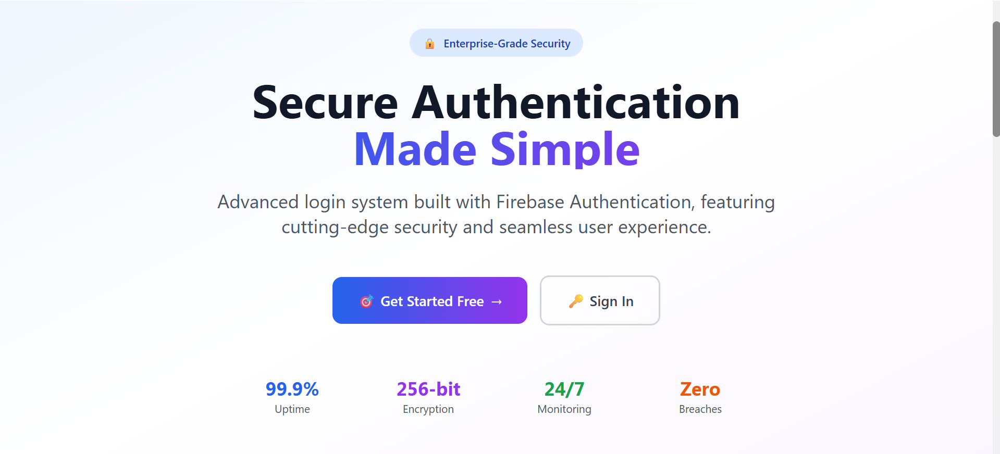
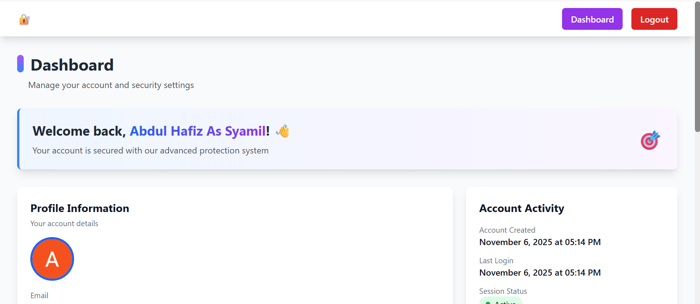

# 💻 Desain dan Implementasi Sistem Login Aman Menggunakan Firebase Authentication dan Firestore

Sistem ini dirancang untuk **mengamankan proses autentikasi pengguna** menggunakan layanan **Firebase Authentication** dan **Firestore Database**.  
Proyek ini mencakup fitur login, registrasi, verifikasi email, manajemen profil pengguna, reset kata sandi, dan penghapusan akun.  
Dikembangkan dengan antarmuka modern berbasis **React + Tailwind CSS** dan di-*deploy* secara aman menggunakan **Vercel**.

---

## 🚀 Fitur Utama

✅ **Email & Password Authentication** — Login dan registrasi pengguna secara aman  
✅ **Email Verification** — Validasi alamat email pengguna sebelum akses penuh  
✅ **User Profile Management** — Pengguna dapat memperbarui data profil  
✅ **Password Reset** — Reset kata sandi melalui email  
✅ **Account Deletion** — Penghapusan akun secara permanen  
✅ **Protected Routes** — Akses halaman tertentu hanya untuk pengguna terverifikasi  
✅ **Responsive UI** — Tampilan modern dan responsif menggunakan Tailwind CSS  

---

## 🧩 Teknologi yang Digunakan

### ⚙️ Frontend
- 🟢 **Node.js** `v24.11.0`
- ⚛️ **React Router DOM**
- 🎨 **Tailwind CSS**
- ⚡ **Vite**

### 🔥 Backend
- 🔑 **Firebase Authentication**
- 🗃️ **Firestore Database**

### ☁️ Deployment & Version Control
- ▲ **Vercel**
- 🧠 **Git & GitHub**

### 🛡️ Keamanan
- 🔐 **Firebase Security Rules**
- 🌐 **HTTPS / SSL**
- 🧱 **Security Headers**

---

## 📸 Cuplikan Tampilan

## 👨‍💻 Author
- **Abdul Hafiz As Syamil (NIM: 220170160)**
